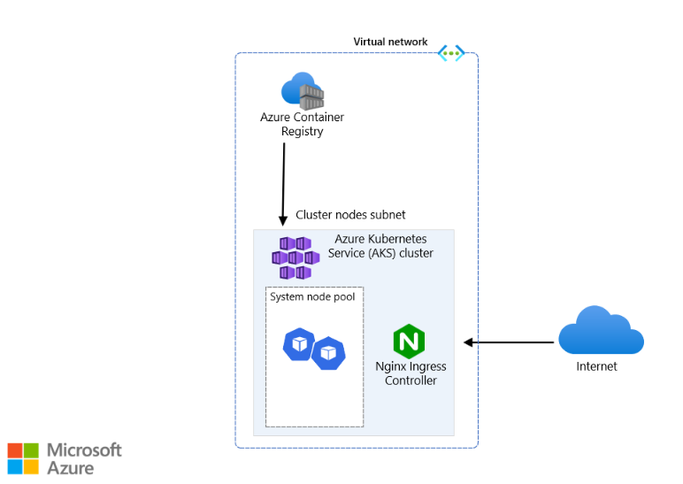

# AKS Deployment with Terraform

## Overview
This project is deployed on Azure. It creates a Virtual Network (VNet), an Azure Kubernetes Service (AKS) cluster with a managed NGINX ingress controller, and an Azure Container Registry (ACR) using Terraform. It then deploys a basic FastAPI backend with a single endpoint you can test.



## Prerequisites

To run the project, ensure you meet the following prerequisites:

1. **Azure Subscription**: You need an active Azure subscription.
2. **Azure CLI**: Make sure you have Azure CLI installed locally. You can install it from [here](https://docs.microsoft.com/en-us/cli/azure/install-azure-cli).
3. **Permissions**: You need the necessary permissions to create a service principal in your Azure tenant.

## Setting Up Azure Service Principal

Before deploying the project, you need to create a service principal in Azure using the Azure CLI. To do this, run the following command:

```bash
az ad sp create-for-rbac --name tf-sp --role owner --scopes /subscriptions/<subscriptionid> --json-auth
```
Replace <subscriptionid> with your actual subscription ID.

## Fork the Repository
To start your deployment you need to:
1. Fork the repository to your own GitHub account.
2. Create a repository secret named AZURE_CREDENTIALS.
3. Store the JSON value returned by the service principal creation command in the AZURE_CREDENTIALS secret.

## Running the Pipeline
After setting up the repository secret, you are ready to run the pipeline Deploy.

## Testing Endpoint
The IP of the app will be available at the end of the "Get IP of Ingress" step of the pipeline, feel free to test the endpoint by sending a get request at the given IP.

## Destroying Resources
To destroy the created resources you can login to your Azure account 

```bash
az login
```
locate the created resource group and delete it (if you can't find the name of the resource group, you can find it in the pipeline output at the end of the Terraform Apply step)


```bash
az group delete --name <resource group name>
```